## Un poco sobre mí {background-color="#1A428A"}

<br>

::: columns
::: {.column width="60%"}
- Investigadora de CONICET en el Instituto Gulich
- Formación: Lic. & Dra. en Biología, Mgter. en Aplicaciones de la Información Espacial
- Aplicaciones de SR en ecología de enfermedades
- Miembro del equipo de desarrollo de **GRASS**; miembro de OSGeo y entusiasta del FOSS4G

 <https://veroandreo.gitlab.io/>
:::

::: {.column width="40%"}
```{r}
#| echo: false
#| fig-height: 4
#| fig-width: 4
library(leaflet)
leaflet() %>%
  addTiles() %>%  # Add default OpenStreetMap map tiles
  addMarkers(lng=-64.4653258, lat=-31.5204194, popup="IG")
```

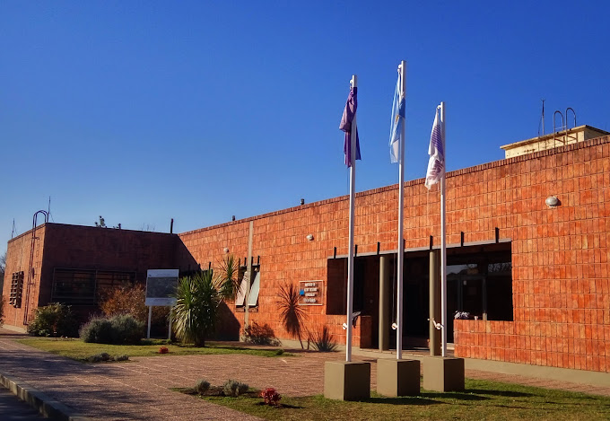{width="50%" fig-align="center"}
:::
:::

------------------------------------------------------------------------

## Overview {background-color="#1A428A" background-image="assets/img/lecture/RS_and_Public_Health_vertical.png" background-size="32%" background-position="right"}

- Motivación
- Geografía de la salud
- Ecología de las enfermedades
- Introducción al SR y los SIG
  - ¿Qué es el SR o Teledetección?
  - ¿Qué es un SIG?
- SR y ecología de enfermedades
  - Resolución vs escala
  - ¿Cómo utilizamos el SR?
  - Ejemplos
- Brechas, desafíos y oportunidades
- Conclusiones


------------------------------------------------------------------------

::: r-stack
<!-- 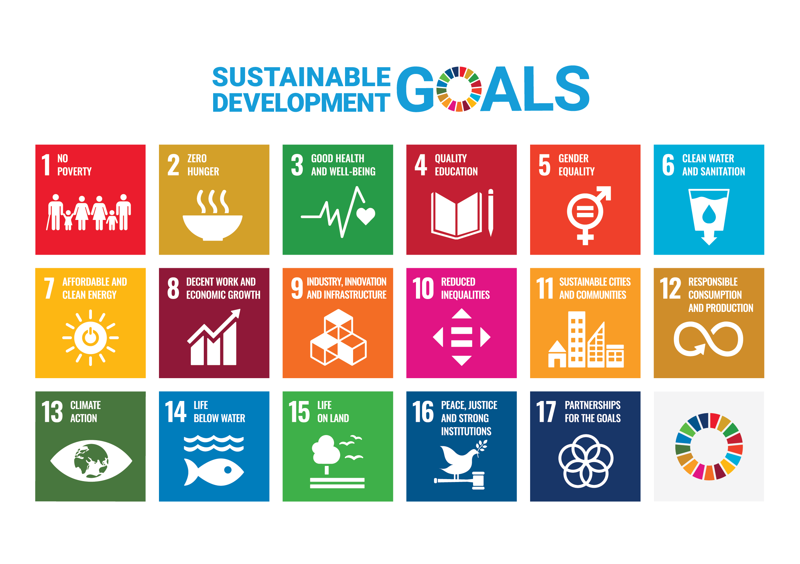{.fragment .fade-in-then-out fragment-index="2" width="90%"} -->

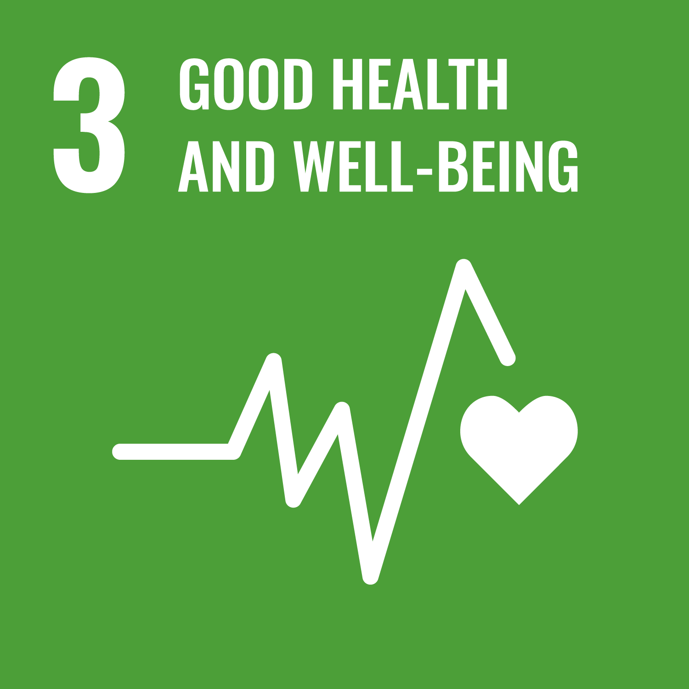{.fragment .fade-in-then-out fragment-index="1" width="55%" fig-align="center"}

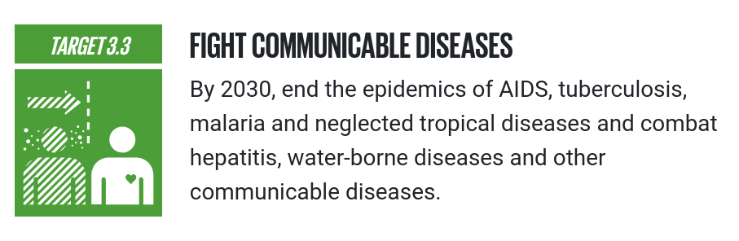{.fragment .fade-in fragment-index="2" width="100%" fig-align="center"}
:::

::: footer
<https://sdgs.un.org/goals/goal3>
:::

::: notes
Las enfermedades transmitidas por vectores y las zoonosis son responsables de una sexta parte de las enfermedades y discapacidades en todo el mundo. Esta es una de las razones por las que la buena salud y el bienestar se encuentran entre los 17 objetivos de la ONU para un desarrollo sostenible. Más concretamente, el objetivo es acabar con las epidemias de ETD, entre otras enfermedades transmisibles.
:::

------------------------------------------------------------------------

### Enfermedades Tropicales Desatendidas

<br>

::: columns
::: {.column width="50%"}
{fig-align="center"}
:::

::: {.column width="50%"}
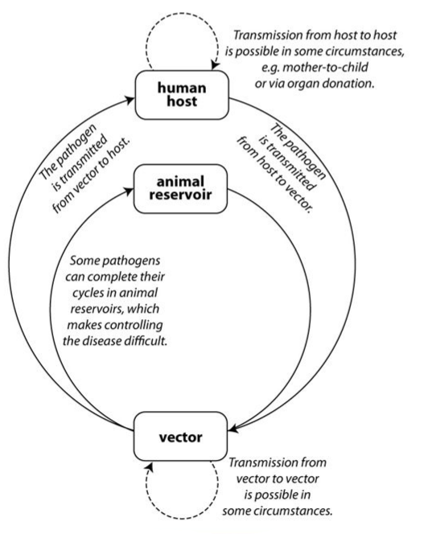{.fragment .fade-in width="80%" fig-align="center"}
:::
:::

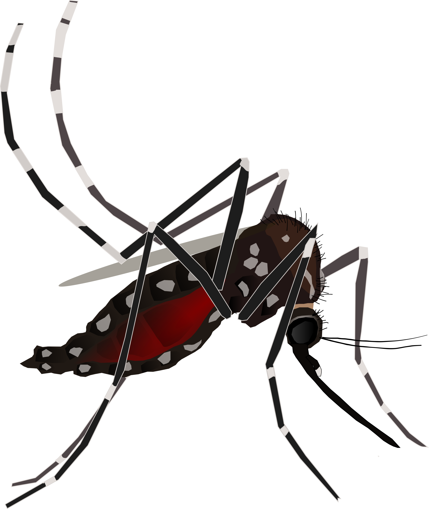{.fragment .absolute bottom="40" right="380" width="150"}

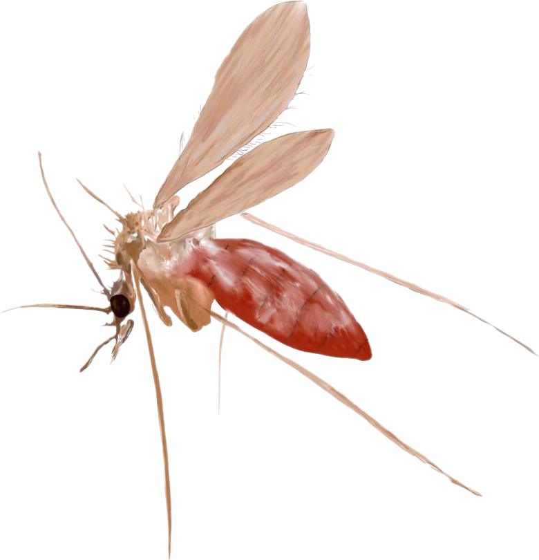{.fragment .absolute top="5" right="-30" width="170"}

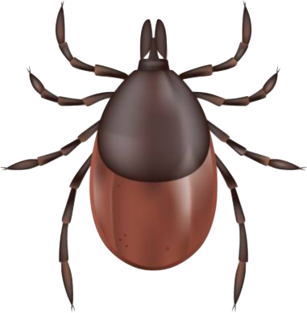{.fragment .absolute bottom="130" right="-30" width="120"}

::: notes
Ahora bien, ¿cuáles son estas ETD y por qué la teledetección y los SIG podrían ser relevante para su estudio? Bueno, como puede ver, la mayoría de estas enfermedades son transmitidas por animales, necesitan un vector para transportar el patógeno del huésped a los humanos o entre humanos. Los animales, especialmente los ectotermos, se ven muy afectados por las condiciones ambientales de una determinada zona... piensen en los mosquitos Aedes aegypti por ejemplo... ¿y qué información se puede extraer más fácilmente de la RS? Sí, la ambiental
:::

------------------------------------------------------------------------

::: center
¿Vieron esto alguna vez?
:::

::: columns
::: {.column width="60%"}

:::

::: {.column width="7%"}
:::

::: {.column width="30%"}
<br>

::: r-stack
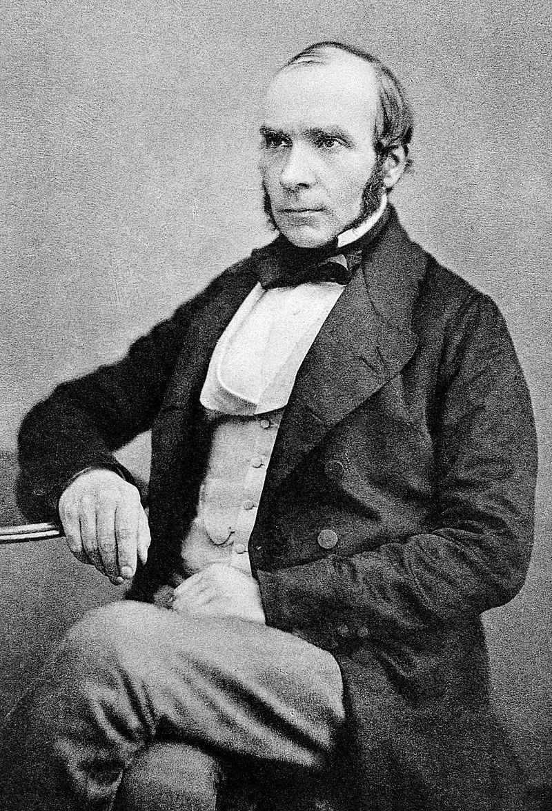

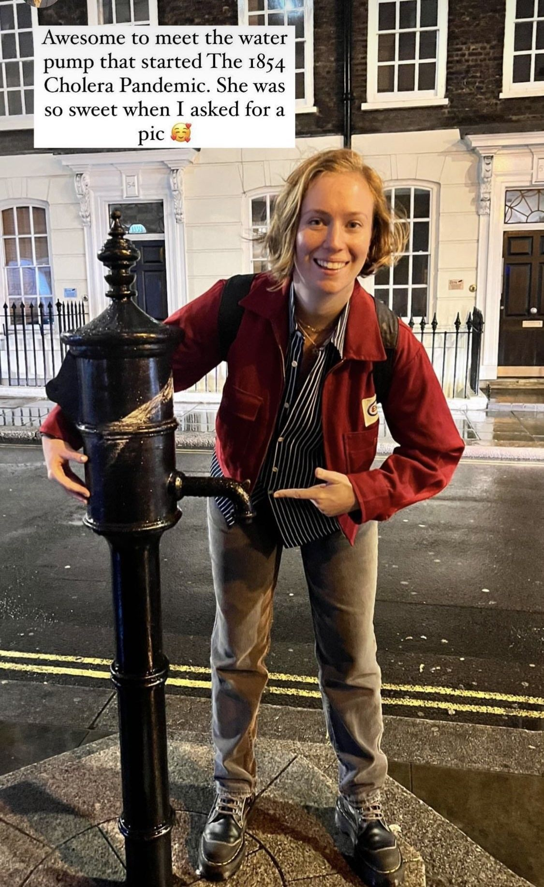{.fragment .fade-in-then-out width="100%"}
:::

:::
:::

::: notes
Antes de llegar al núcleo de los usos y aplicaciones de la teledetección hay un par de cosas que sucedieron primero y algunas definiciones que me gustaría compartir... ¿Alguna vez vieron este mapa? Esta suele ser la primer diapo de la primer clase de un curso de SIG, pero también, la primera vez que la asociación entre salud/enfermedad y lugar/espacio fue claramente mapeada.
:::

## Geografía de la Salud

<br>

::: columns
::: {.column width="33%"}
::: {.color-box-light-blue .fragment fragment-index="1"}
**Salud ambiental**: estudia los peligros ambientales, la evaluación del riesgo ambiental y las repercusiones físicas y psicosociales de la contaminación ambiental en la salud.
:::
:::

::: {.column width="33%"}
::: {.color-box-light-blue .fragment fragment-index="3"}
**Ecología de enfermedades**: estudio de las enfermedades y su relación con la distribución espacial de condiciones ambientales, sociales, políticas y económicas.
:::
:::

::: {.column width="33%"}
::: {.color-box-light-blue .fragment fragment-index="2"}
**Prestación sanitaria y acceso**: modelos y patrones espaciales de prestación de asistencia sanitaria y comportamiento de los pacientes.
:::
:::
:::

::: notes
Este fue el comienzo de lo que se denominó geografía de la salud: la aplicación de información, perspectivas y métodos geográficos al estudio de la salud, la enfermedad y la asistencia sanitaria. Dentro de esta disciplina podríamos identificar 3 campos de estudio: Salud ambiental, Acceso a la salud y Ecología de la enfermedad.
:::

## Geografía de la Salud

<br>

::: columns
::: {.column width="33%"}
::: color-box-light-blue
**Salud ambiental**: estudia los peligros ambientales, la evaluación del riesgo ambiental y las repercusiones físicas y psicosociales de la contaminación ambiental en la salud.
:::
:::

::: {.column width="33%"}
::: color-box-light-magenta
**Ecología de enfermedades**: estudio de las enfermedades y su relación con la distribución espacial de condiciones ambientales, sociales, políticas y económicas.
:::
:::

::: {.column width="33%"}
::: color-box-light-blue
**Prestación sanitaria y acceso**: modelos y patrones espaciales de prestación de asistencia sanitaria y comportamiento de los pacientes.
:::
:::
:::

::: notes
Aunque la RS tiene aplicaciones en todos los campos, me centraré en los relacionados con la ecología de la enfermedad, ya que es donde más experiencia tengo.
:::

## Ecología de las enfermedades I

::: columns
::: {.column width="57%"}
<br><br> 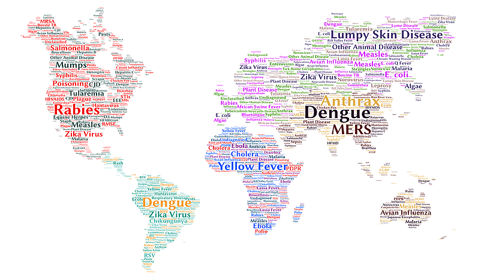{width="700"}
:::

::: {.column width="43%"}
El objetivo principal es comprender la influencia de los factores ambientales y predecir cuándo y dónde es más probable que se produzca una enfermedad

::: {style="display: flex; align-items: center; justify-content: center;"}

:::

toma de decisiones, planificación de acciones de prevención, gestión o respuesta, etc.
:::
:::

## Ecología de las enfermedades II

::: r-stack
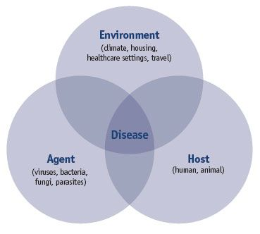{.fragment width="150%" fig-align="center"}

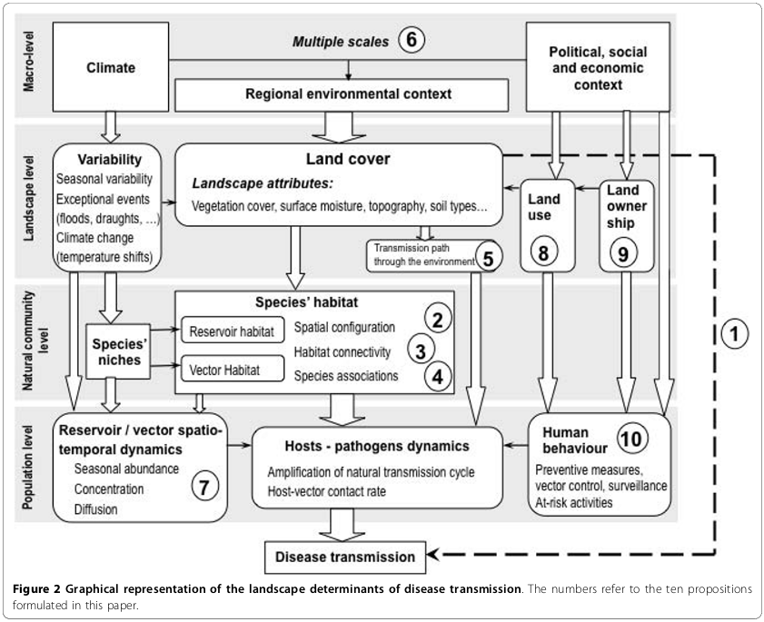{.fragment width="85%" fig-align="center"}

::: {.fragment data-id="box" style="background: rgba(232, 31, 118, 0.2); border: 5px solid; border-color: #e81f76; width: 700px; height: 370px; transform: translate(0%, -26%);"}
:::
:::

::: footer
@lambin_pathogenic_2010
:::

::: notes
Esta relación con el entorno suele representarse mediante una tríada, la tríada epidemiológica. Para que se produzca una enfermedad (en humanos) necesitamos unas condiciones ambientales adecuadas, un patógeno y unos huéspedes y vectores competentes. Estas relaciones pueden dibujarse de forma un poco más compleja, pero la base es la misma, es decir, el  ambiente engloba el clima, las LULCC, la fragmentación del hábitat, el comportamiento humano y todas las relaciones entre ellos. Esto es lo que normalmente intentamos observar con el RS.
:::

## Uso de SR en aplicaciones de Salud

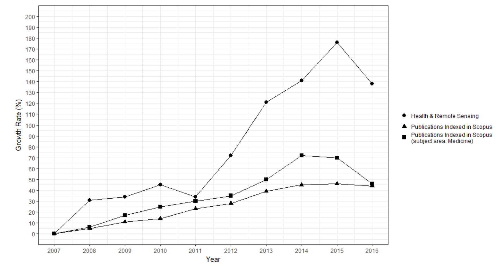{width="90%"}

::: footer
@viana_remote_2017
:::

::: notes
De hecho, el uso de la teledetección para aplicaciones de salud pública ha ido en aumento desde 2007 según esta revisión, pero yo diría que empezó incluso antes.
:::

## Variables de SR más utilizadas

::: columns
::: {.column width="60%"}
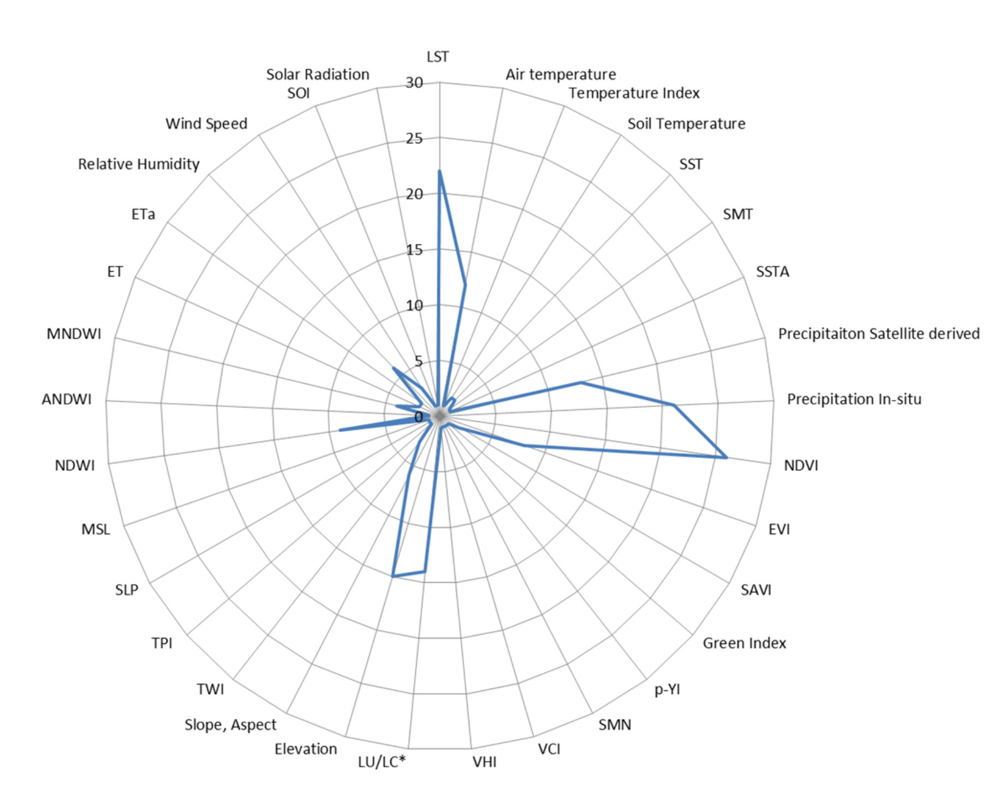{fig-align="center"}
:::

::: {.column width="40%"}

<br>

::: {.color-box-light-blue style="font-size: 0.75em;"}
-   **LST**: Temperatura de Superficie Terrestre
-   **Precipitación**: lluvia estimada por radar/microondas
-   **NDVI**: Índice de Vegetación (densidad/vigor)
-   **LULC**: Uso y Cobertura del Suelo
-   **Elevación**: modelo digital del terreno (DSM, DEM, DTM)
-   **NDWI**: Índice de Agua (humedad/agua superficial)
:::
:::
:::

::: footer
@parselia_satellite_2019
:::

::: notes
Las variables más utilizadas en general son: LST, Precipitación, NDVI, Elevación... Esto es para los mosquitos, si pensamos en garrapatas o ratones, por ejemplo, variables de vegetación se utilizan con más frecuencia
:::

##  {background-image="assets/img/lecture/portada_campo_satelite_sig.png"}

::: {style="color: #ffffff; font-size: 1.2em;"}
**¿Cómo mapeamos estas variables de forma continua?**
Del termómetro y la libreta de campo, al dato satelital.
:::

------------------------------------------------------------------------

## ¿Qué es el Sensado Remoto?


Es la **obtención de información sobre objetos o fenómenos sin estar en contacto directo** con ellos, a través de la detección de la energía electromagnética que emiten o reflejan.

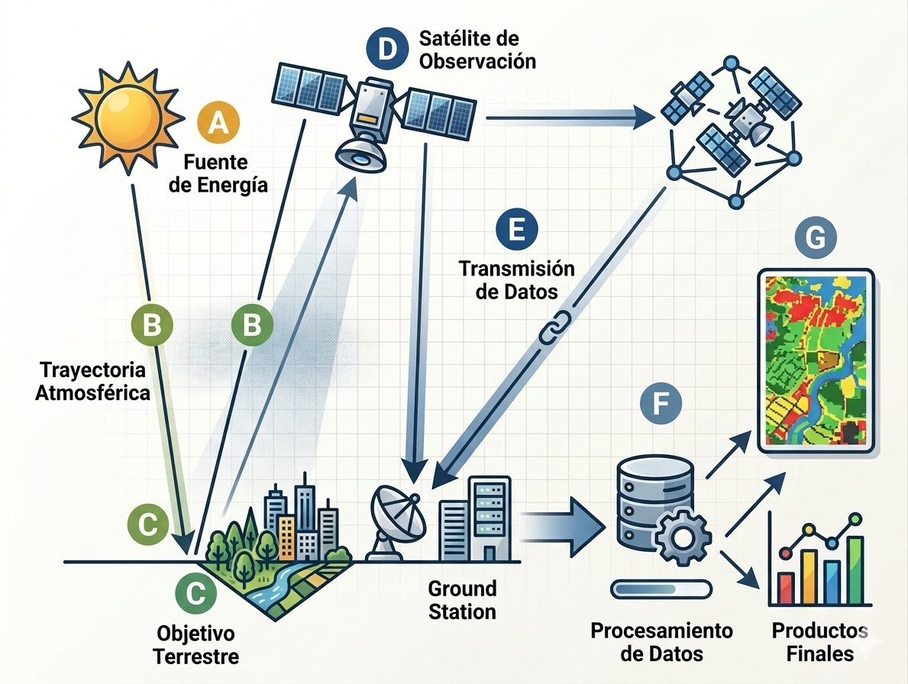{width="100%" fig-align="center"}


::: notes
El sensado remoto o teledetección es la ciencia y el arte de obtener información sobre un objeto, área o fenómeno a través del análisis de datos adquiridos por un dispositivo que no está en contacto físico con el objeto. Los satélites, aviones o drones llevan sensores que registran la energía reflejada o emitida por la superficie terrestre.

Un sistema de sensado remoto tiene cuatro componentes fundamentales: una fuente de energía (generalmente el sol, aunque algunos sistemas como SAR generan su propia), la interacción de esa energía con la superficie (cada tipo de cobertura refleja o emite de forma diferente), el sensor que registra esa energía, y todo el proceso de transmisión y procesamiento de los datos hasta llegar a productos listos para usar.
:::

------------------------------------------------------------------------

## El espectro electromagnético

<br>

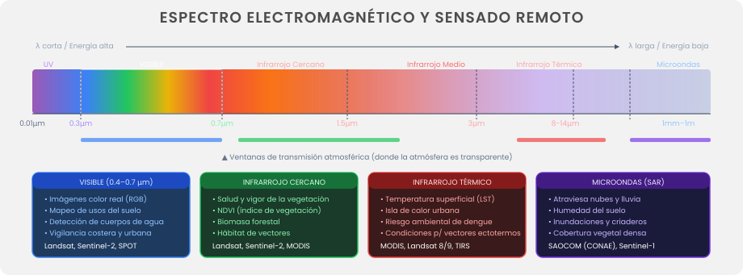{width="100%" fig-align="center"}

::: notes
El espectro electromagnético abarca desde los rayos gamma hasta las ondas de radio. Los satélites de observación de la Tierra trabajan principalmente en cuatro regiones: el visible (lo que vemos con nuestros ojos), el infrarrojo cercano (fundamental para estudiar vegetación), el infrarrojo térmico (para medir temperatura superficial) y las microondas (los radares SAR, que pueden atravesar nubes). Cada región tiene ventanas de transmisión atmosférica donde la atmósfera es suficientemente transparente para permitir las mediciones.
:::

------------------------------------------------------------------------

## ¿Qué mide el sensor?

Los sensores miden la **energía electromagnética** que llega al detector en cada banda:

::: columns
::: {.column width="55%"}

<br>

::: {.color-box-light-blue}
**Radiancia** *(W·sr⁻¹·m⁻²)*  
Energía que recibe el sensor - incluye efectos atmosféricos
:::

<br>

::: {.color-box-light-blue}
**Reflectancia** *(adimensional, 0-1)*  
Fracción de luz solar reflejada por la superficie - se obtiene tras aplicar la **corrección atmosférica**
:::
:::

::: {.column width="45%"}

<br>

{width="90%"}
:::
:::

------------------------------------------------------------------------


## Firmas espectrales

La "huella digital" de cada cobertura

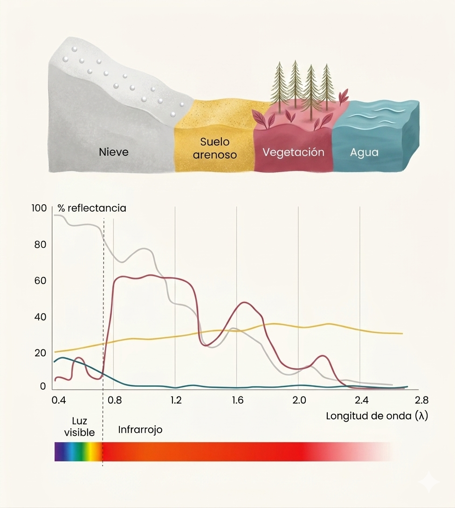{width="95%" fig-align="center"}

::: notes
Cada tipo de cobertura terrestre tiene una curva de reflectancia característica según la longitud de onda. La vegetación sana refleja muy poco en el rojo (la clorofila absorbe esa luz para la fotosíntesis) pero mucho en el infrarrojo cercano (la estructura celular de las hojas la refleja). Esta diferencia tan marcada es la base del NDVI. El agua absorbe casi toda la energía en el infrarrojo, por eso aparece oscura en esas bandas. El suelo tiene una reflectancia creciente y más uniforme. La vegetación estresada (seca, enferma) pierde ese salto en el NIR, lo que nos permite detectar problemas antes de que sean visibles a simple vista.
:::

------------------------------------------------------------------------

## Variables derivadas del SR

<br>

::: columns
::: {.column width="33%"}
::: {.color-box-light-blue style="font-size: 0.75em;"}
**Índices espectrales**  
Combinaciones de bandas de reflectancia

`(NIR − Rojo) / (NIR + Rojo)`

- NDVI → vegetación
- NDWI → agua / humedad  
- NDBI → área construida
:::
:::

::: {.column width="33%"}
::: {.color-box-light-blue style="font-size: 0.75em;"}
**Variables físicas**  
Magnitudes reales derivadas con modelos

- LST → temperatura superficial (°C/K)
- Albedo → fracción reflejada total
- LAI → índice de área foliar
- Precipitación (microondas)
:::
:::

::: {.column width="33%"}
::: {.color-box-light-blue style="font-size: 0.75em;"}
**Productos temáticos**  
Clasificaciones e interpretaciones

- LULC → uso y cobertura del suelo
- Mapas de vegetación
- Detección de cambios (LULCC)
- Mapas de riesgo (con SIG)
:::
:::
:::

::: notes
Esta distinción es importante: los índices espectrales son operaciones directas sobre las bandas de reflectancia, adimensionales. Las variables físicas requieren modelos más complejos y tienen unidades reales. Los productos temáticos son el resultado de clasificar o interpretar las imágenes, y suelen combinar varias fuentes de información.
:::


## ¿Qué es un SIG?

<br>

Un **Sistema de Información Geográfica (SIG)** es un sistema que permite **capturar, almacenar, analizar y visualizar datos con una componente espacial**:

<br>

::: columns
::: {.column width="48%"}
**SR → cómo *obtenemos* los datos**

- Imágenes satelitales
- Variables ambientales
- Temperatura, vegetación, lluvia...
:::

::: {.column width="4%"}
:::

::: {.column width="48%"}
**SIG → cómo los *integramos y analizamos***

- Combinamos capas de información
- Datos de casos de enfermedad + variables ambientales
- Generamos mapas de riesgo
:::
:::

::: notes
El SIG es el "laboratorio espacial" donde integramos toda la información. Puede pensarse como una versión muy poderosa de un mapa digital donde podemos superponer capas de información muy distintas: imágenes satelitales, datos de casos de enfermedades, límites administrativos, redes viales, etc., y analizarlas en conjunto para encontrar patrones o modelar riesgos.
:::


##  {background-image="assets/img/lecture/portada_muchos_satelites.png"}

::: {style="color: #ffffff; font-size: 1.2em;"}
**¿Y cómo elegir qué datos usar para mi problema?**
:::

------------------------------------------------------------------------

## El problema de la resolución

::: columns
::: {.column width="55%"}
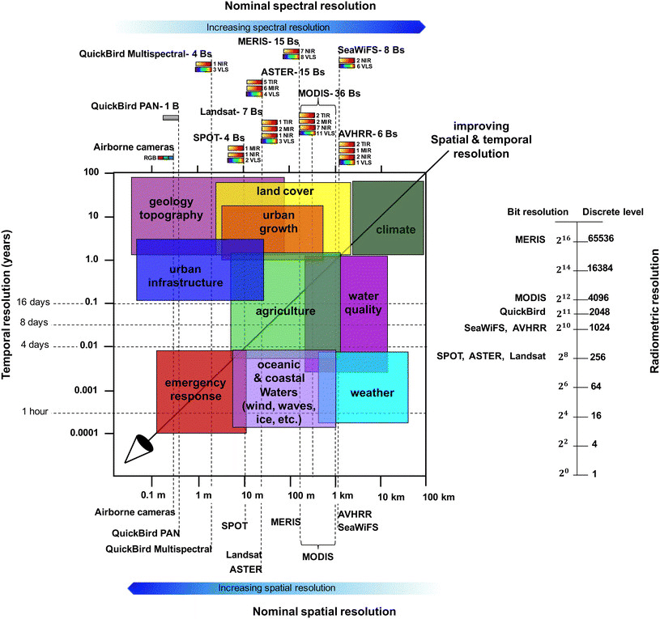{fig-align="center"}
:::

::: {.column width="45%"}

<br>

::: {style="font-size: 0.65em;"}
| Resolución | Pregunta | Ejemplo |
|---|---|---|
| **Espacial** | ¿Cuánto mide cada píxel? | Landsat: 30m; Sentinel-2: 10m |
| **Temporal** | ¿Cada cuánto pasa el satélite? | MODIS: diario; Landsat: 16 días |
| **Espectral** | ¿Cuántas bandas captura? | Sentinel-2: 13 bandas |
| **Radiométrica** | ¿Cuántos niveles de gris distingue? | 8 bits = 256 niveles |

:::
:::
:::

::: footer
@dif_resolutions_2018
:::

::: notes
Antes de seleccionar qué datos usar, debemos entender que los satélites tienen cuatro tipos de resolución que están en tensión entre sí. Un satélite con píxeles muy pequeños (alta resolución espacial) suele pasar con menos frecuencia y tener menos bandas. Por eso para estudiar dengue en toda una ciudad usamos datos distintos que para detectar un nido de garrapatas.
:::


## El problema de la escala

<br>

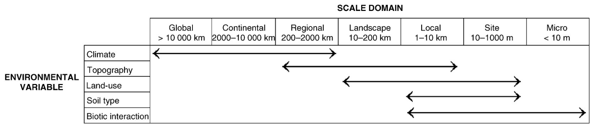{fig-align="center"}

::: footer
@pearson_predicting_2003
:::

::: notes
Para decidir qué conjunto de datos de RS se adapta mejor a nuestro problema también debemos pensar en la escala a la que operan las variables. Esto muestra, por ejemplo, la relación de las var amb y la distribución de las especies según la escala.
:::

## Resolución y escala

::: panel-tabset
## Taxonomía

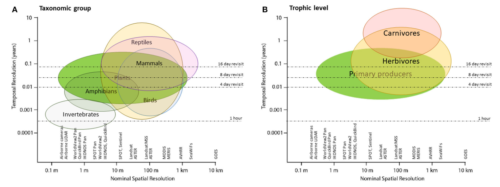{fig-align="center"}

## Plantas

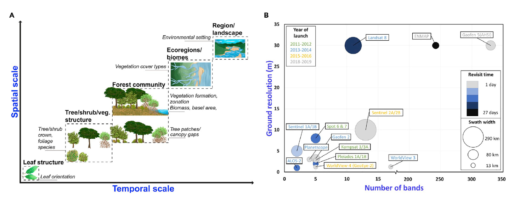{fig-align="center"}

## Animales

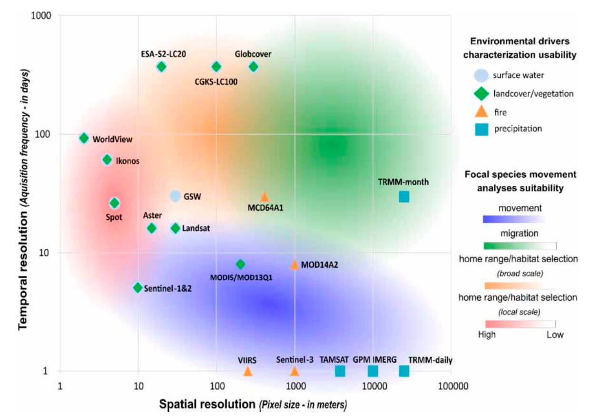{width="65%" fig-align="center"}
:::

::: footer
@leitao_improving_2019, @lechner_applications_2020, @rumiano_movement_2020
:::

::: notes
También si estudiamos otros fenómenos biológicos o ecológicos debemos tener en cuenta la escala y pensar qué tipo de producto de RS sería el más adecuado.
:::

## ¿Cómo aplicar SR en ecología de enfermedades?

<br>

::: r-stack
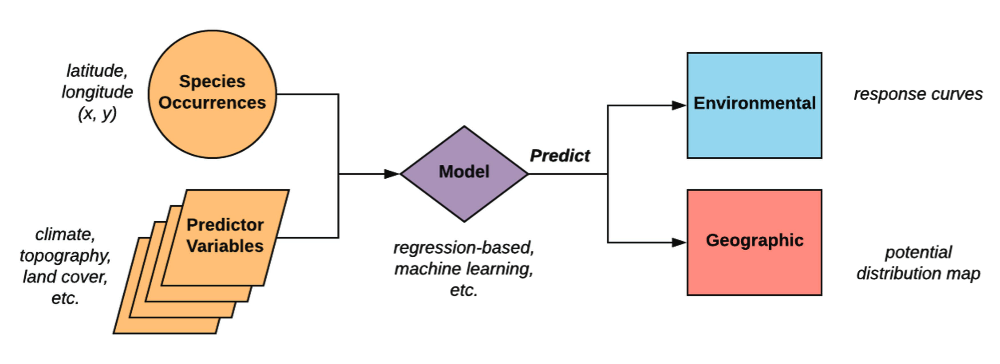

::: {.fragment data-id="box1" style="background: rgba(232, 31, 118, 0.2); border: 5px solid; border-color: #e81f76; width: 300px; height: 140px; transform: translate(-115%, -77%);"}
:::

::: {.fragment data-id="box2" style="background: rgba(232, 31, 118, 0.2); border: 5px solid; border-color: #e81f76; width: 300px; height: 160px; transform: translate(-115%, 30%);"}
:::

::: {.fragment data-id="box3" style="background: rgba(232, 31, 118, 0.2); border: 5px solid; border-color: #e81f76; width: 330px; height: 300px; transform: translate(100%, -10%);"}
:::
:::

::: notes
Volviendo a la ecología de las enfermedades, ¿para qué utilizamos la RS? - Para cartografiar las variables de respuesta, es decir, la presencia o abundancia de especies, las infecciones, los casos de enfermedad - Para cartografiar las variables predictoras - Para validar las predicciones
:::

##  {background-image="assets/img/lecture/portada_ejemplos_usos.png"}

::: {style="color: #ffffff; font-size: 1.5em;"}
Veamos algunos casos reales...
:::

------------------------------------------------------------------------

### Detección y mapeo de especies

<br>

- Imágenes de muy alta resolución espacial (VHR)
- Datos hiperespectrales (especialmente para especies vegetales)
- Recuento directo e indirecto (CV, ML, DL)

::: columns
::: {.column width="53%"}
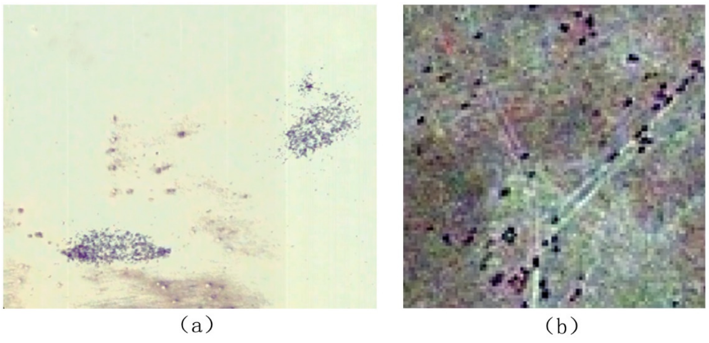
:::

::: {.column width="47%"}
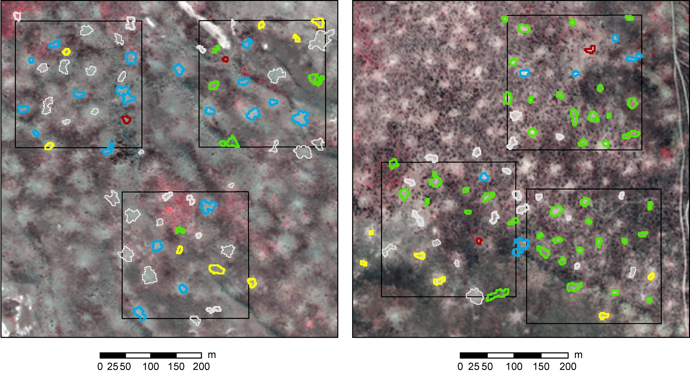
:::
:::

::: footer
@wang_surveying_2019
:::

------------------------------------------------------------------------

### Detección y mapeo de especies

<br>

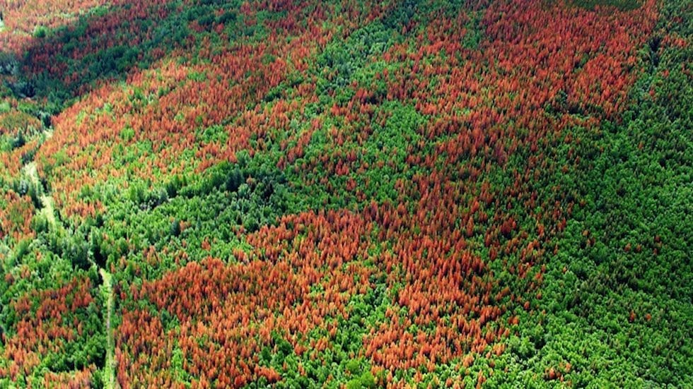{width="70%"}

::: {style="float: right; transform: translate(0%, -100%);"}
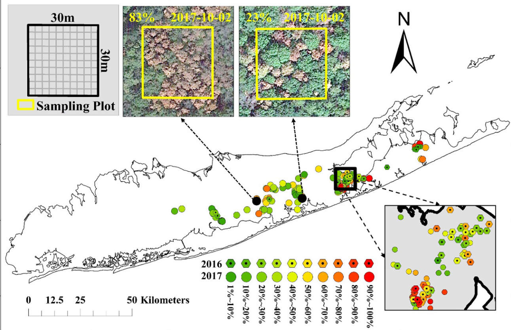{width="550px"}
:::

::: footer
@meng_landsat_based_2022
:::

------------------------------------------------------------------------

### Series temporales de productos satelitales {.smaller}

- Reconstrucción temporal y espacial MODIS LST (LWR & splines)
- Estimación de índices temporales (GRASS)
- Detección de agrupaciones espaciales y temporales de condiciones favorables para la aparición de casos de WNF

::: columns
::: {.column width="33%"}
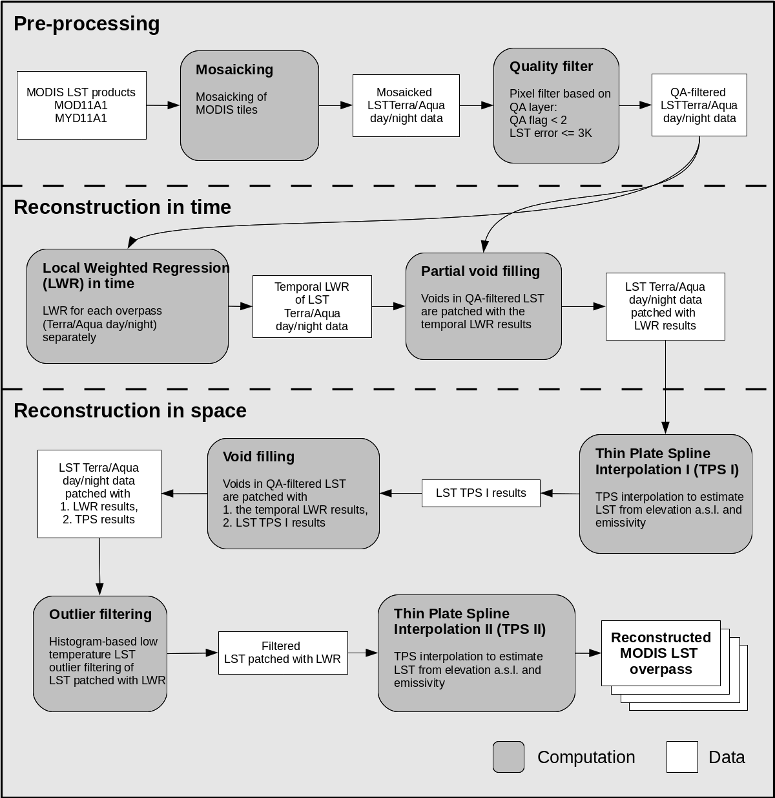

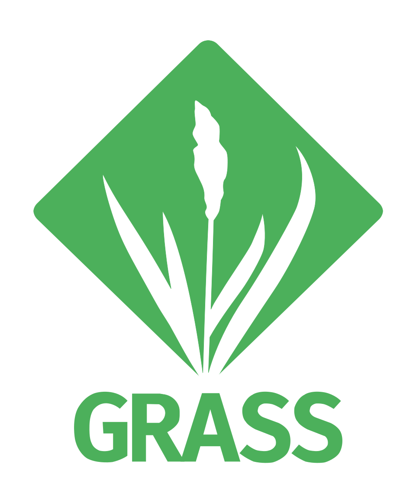{.absolute top="350" left="-100" width="85"}
:::

::: {.column width="67%"}
<br>

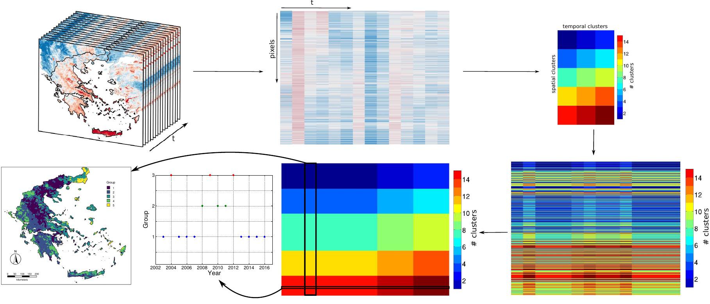{.fragment .grow}
:::
:::

::: footer
@metz_new_2017, @andreo_identifying_2018
:::

------------------------------------------------------------------------

### Riesgo ambiental de Dengue

- Estimación del número de periodos de incubación extrínsecos (EIP) que el virus podría completar (MODIS LST); cuanto > sea este número, > será el riesgo ambiental

](assets/img/lecture/riesgo_dengue_por_localidad.png)

::: footer
@porcasi_operative_2012
:::

<!-- ------------------------------------------------------------------------ -->

<!-- ### Distribución de *Aedes aegypti* a futuro -->

<!-- 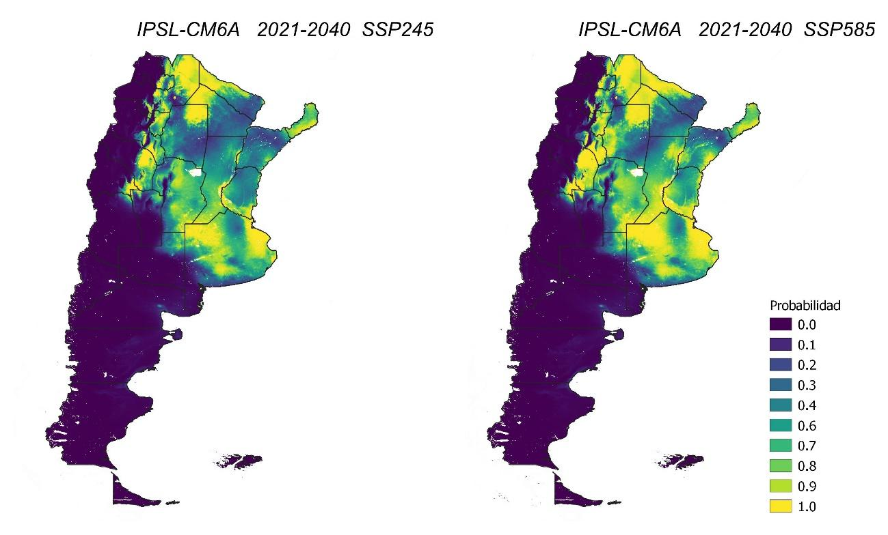 -->

------------------------------------------------------------------------

### SDM y SIG para mapear el riesgo de SPH

::: columns
::: {.column width="50%"}
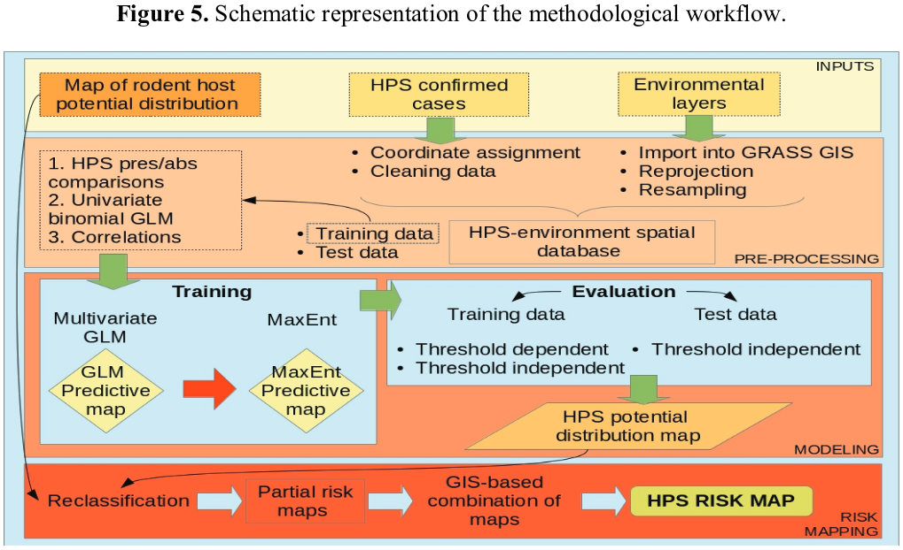 <br>

{width="30%" fig-align="center"}
:::

::: {.column .smaller width="50%"}
Combinamos un mapa de probabilidad del reservorio con uno de los casos humanos para determinar los niveles de riesgo de transmisión

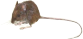{.absolute top="230" right="50" width="210"} <br>

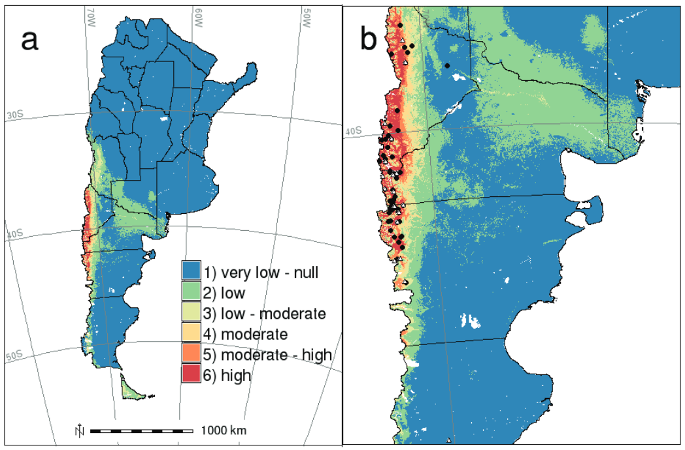
:::
:::

::: footer
@andreo_modeling_2011, @andreo_estimating_2014
:::

------------------------------------------------------------------------

### Leishmaniasis Cutánea & LULCC

{.absolute top="5" right="-30" width="120"}

<br>

::: columns
::: {.column width="50%"}
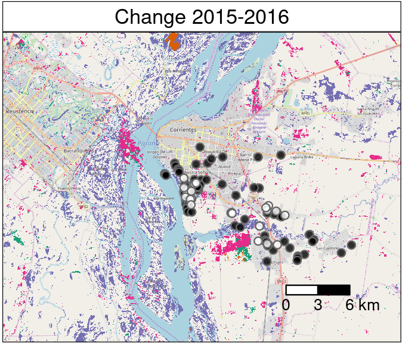

{.fragment .absolute top="400" left="25" width="90"}
:::

::: {.column width="50%"}
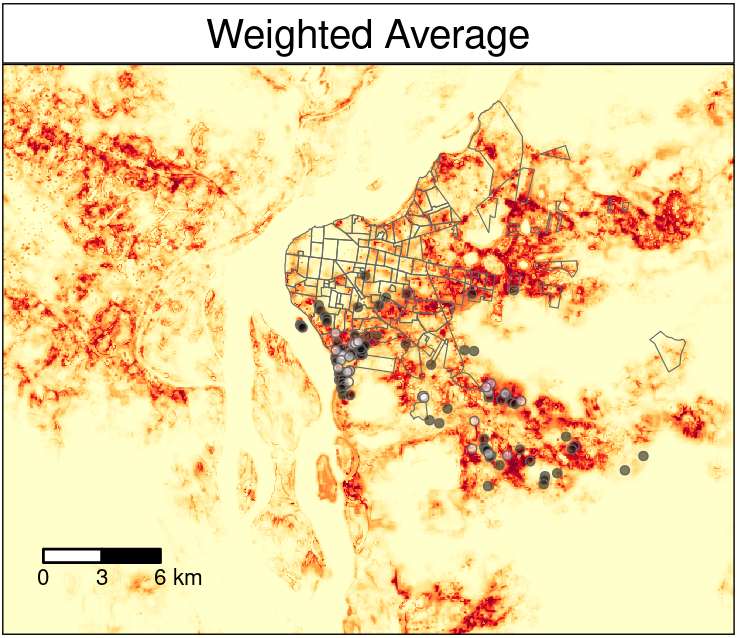
:::
:::

::: footer
@andreo_ecological_2022, [*i.cva*](https://grass.osgeo.org/grass-stable/manuals/addons/i.cva.html)
:::

---

### Hacia mapas de riesgo operativos

::: {.columns}
::: {.column width="60%"}
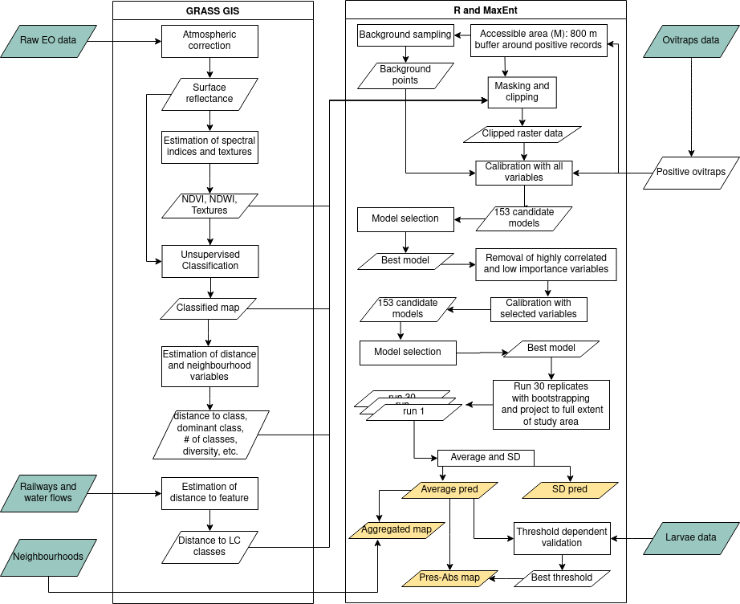

{.fragment .absolute top=200 left=2 width=80}

{.fragment .absolute top=300 left=530 width=85}
:::

::: {.column width="40%"}
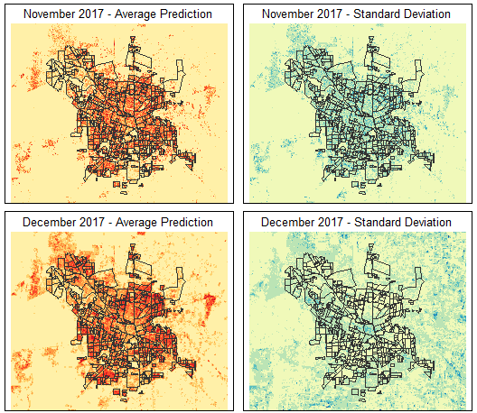

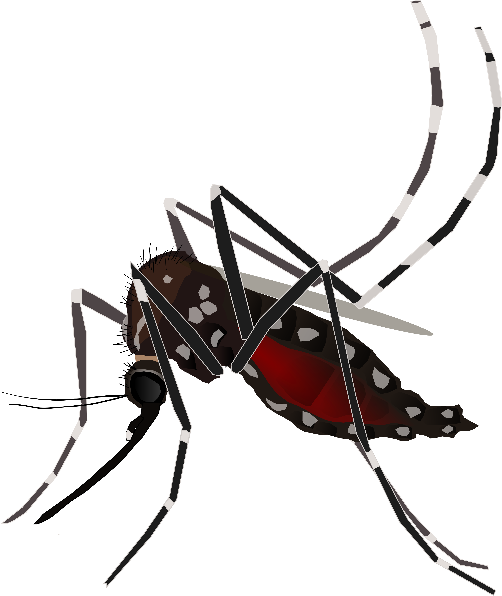{width="32%" style="float: right;"}
:::
:::

::: footer
@andreo_towards_2021
:::

------------------------------------------------------------------------

### Patrones temporales en el espacio

- Patrones temporales y espaciales de *Aedes aegypty* en Córdoba
- Asociación con variables derivadas del análisis de imágenes Sentinel 2 para predecir patrones temporales en toda la ciudad.

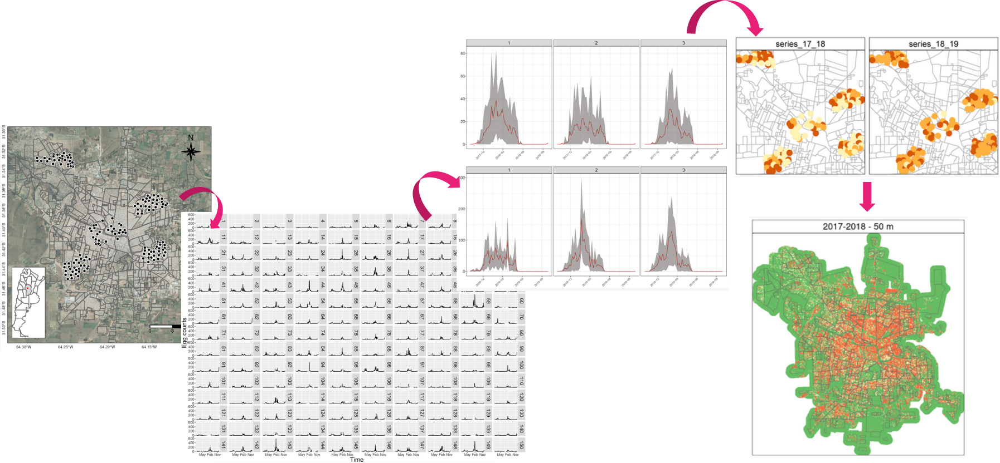{.r-stretch}

{.absolute top="220" left="200" width="120"}

{.fragment .absolute bottom="30" right="420" width="130"}

{.fragment .absolute bottom="30" right="30" width="100"}

::: footer
@andreo_spatial_2021
:::

------------------------------------------------------------------------

### Caracterización ambiental urbana para la distribución de ovitrampas

::: columns
::: {.column width="40%"}
- Clasificación de imágenes VHR basada en objetos
- Métricas de paisaje para polígonos
- Agrupación para encontrar grupos de polígonos similares
- Distribución estratificada de ovitrampas

::: {style="font-size: 0.7em;"}
{width="60" style="float: left; padding-right: 10px"} 
Mgter. **Carla Rodriguez Gonzalez**.
:::
:::

::: {.column width="60%"}
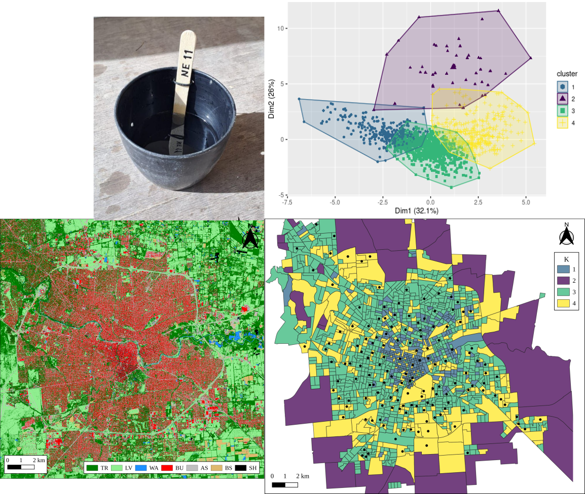
:::
:::

::: footer
@grippa_open_source_2017, @georganos_scale_2018, @rodriguez_gonzalez_using_2023
:::

------------------------------------------------------------------------

### Sistema de predicción basado en dinámica poblacional y pronóstico meteorológico {.smaller}

[https://aplicaciones.gulich.unc.edu.ar/app/](https://aplicaciones.gulich.unc.edu.ar/app/)

::: columns
::: {.column width="50%"}
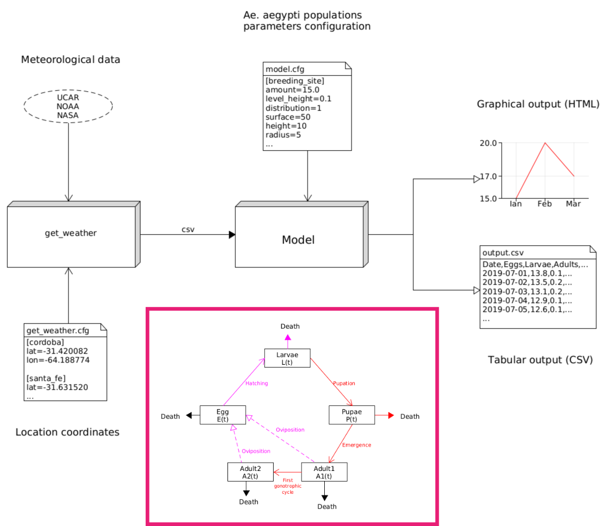{width="80%" fig-align="center"}
<br>

::: {style="font-size: 0.8em;"}
{width=65 style="float: left; padding-right: 10px"} 
Desarrollo de un SAT para dengue. Doctorando, **Tomás San Miguel**. 
:::
:::

::: {.column width="50%"}
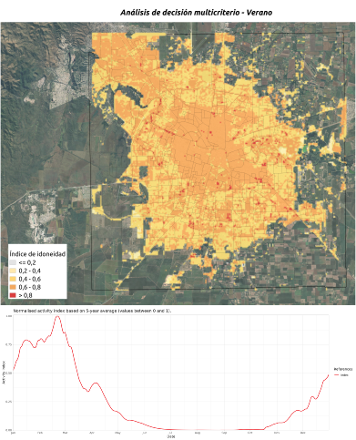{width="75%" fig-align="center"}
:::
:::

::: footer
@aguirre_implementation_2021
:::

------------------------------------------------------------------------

<!-- ### Sistema de vigilancia online

<br>

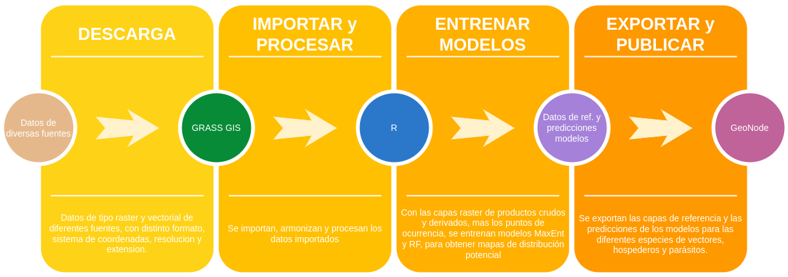{.fragment fig-align="center"}

<br>

{width="500" fig-align="center"} 

::: footer
PROSAT II. BID N° 4840/OC-AR
:::

------------------------------------------------------------------------

### Sistema de vigilancia online

::: r-stack
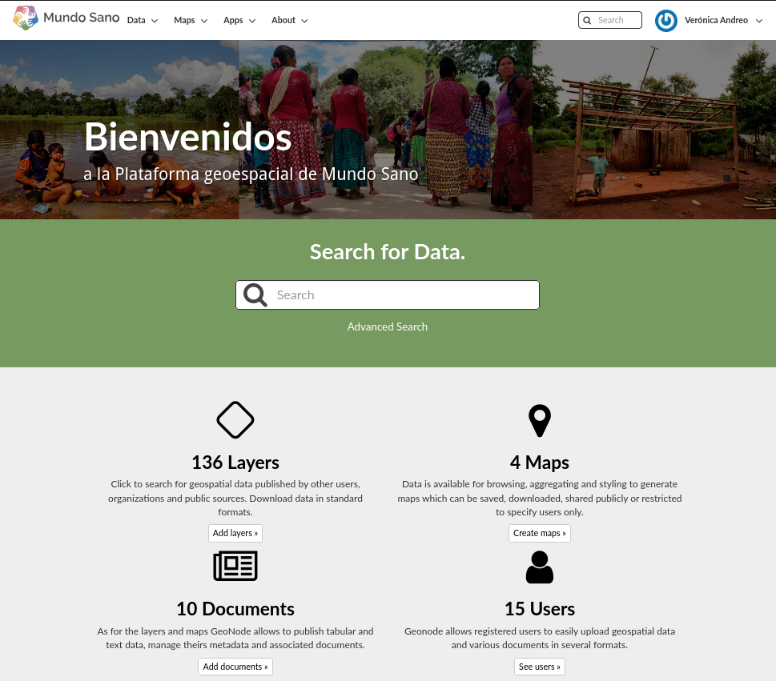{fig-align="center" width="67%"}

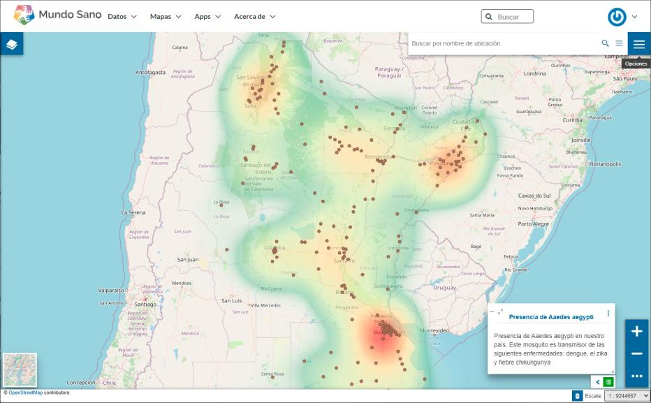{.fragment fig-align="center" width="85%"}

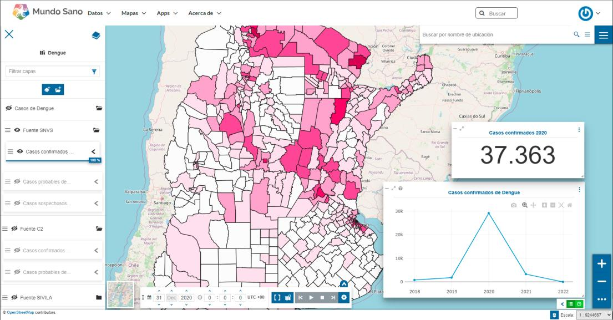{.fragment fig-align="center" width="82%"}
:::

::: footer
PROSAT II. BID N° 4840/OC-AR
:::

------------------------------------------------------------------------ -->

### LULCC y brotes de enfermedades

::: columns
::: {.column width="60%"}
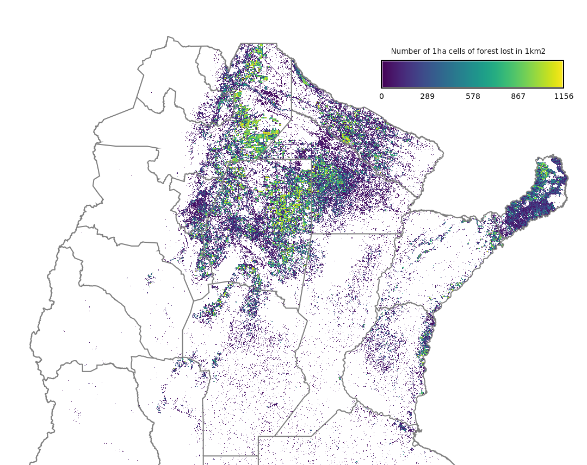
:::

::: {.column width="40%"}
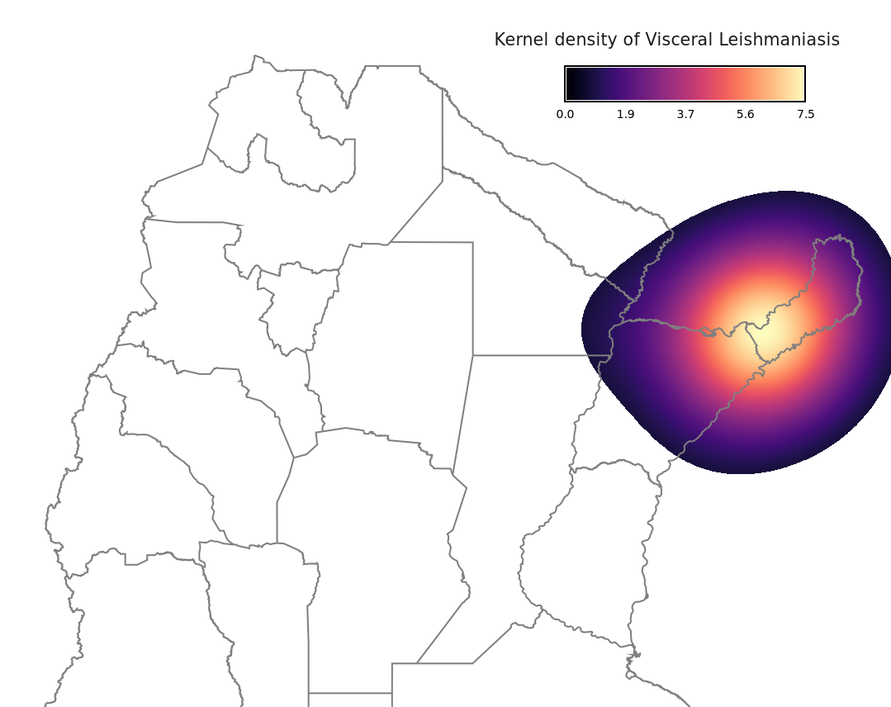{width="60%"}

{width="60%"}
:::
:::

::: footer
PICT 2021 - GRF TI - 00372
:::

---

### Acceso geográfico a la salud

::: columns
::: {.column width="45%"}

::: r-stack


{.fragment}
:::

::: {style="font-size: 0.7em;"}
{width=60 style="float: left; padding-right: 10px"} 
Doctoranda, **Carla Rodriguez Gonzalez**.
:::
:::

:::{.column width="55%"}
{width="90%"}
:::
:::

---

### Incidencia de asma y calidad del aire

::: {.columns}
::: {.column width="45%"}


::: {style="font-size: 0.7em;"}
{width=60 style="float: left; padding-right: 10px"} 
Doctorando, **Abraham Coiman**.
:::
:::

::: {.column width="55%"}

:::
:::


## Otros proyectos en desarrollo {.smaller}

<br><br>

::: {layout="[3, 18]"}
{width="51"} {width="51"}

Distribución de reservorios de Hantavirus en el cono sur. **Dr. Juan Diego Pinotti** & **Dra. Verónica Andreo**.
:::

::: {layout="[3, 18]"}
{width="51"} {width="51"}

Efectos de las olas de calor sobre la salud. **Dra. Anabella Ferral** & **Dra. Ximena Porcasi**.
:::


# Entonces ya está todo estudiado?? {background-color="#1A428A"}


## Brechas y desafíos del SR

{.absolute top="5" right="-15" width="100"}

- **Compromiso** entre las diferentes resoluciones, el problema estudiado, los datos y los métodos disponibles.
- **Huecos en SR óptico**: nubes, sombras (interpolaciones espaciales y temporales)
- **Correcciones** si los datos de alto nivel no son adecuados
- **Acceso limitado** a VHR, LiDAR e hiperespectrales (todavía difíciles de escalar).
- **Inversión y desarrollo de capacidades**: grandes volúmenes de datos vs ancho de banda,  almacenamiento y capacidad de cálculo limitados (computación en la nube, paralelización).

::: color-box-light-blue
[**Los datos de campo siempre serán necesarios! :)**]{style="color: #1a428a;"}
:::

## Desafíos y brechas - Ecología y Salud

<br>

- Falta de información de **línea de base** de distribución de hospedadores, vectores, infección
- Actualización y digitalización de casos de enfermedad y datos de intervención, aún faltan datos en gran parte del mundo
- **Armonización de registros** en diferentes niveles administrativos
- Facilitar el acceso a datos de salud (agregados)
- __Decisión política y asignación de recursos__


## Oportunidades: low hanging fruits?

- Datos SAR para evitar las nubes, ej., [**SAOCOM**](https://saocom.invap.com.ar/) para estimar la humedad del suelo
- Datos LiDAR abiertos, ej., [GEDI](https://gedi.umd.edu/) a bordo de la ISS
- Soluciones de código abierto en la nube [openEO.cloud](https://openeo.cloud/), [actinia](https://actinia.mundialis.de/), otros?

::: columns
::: {.column width="34%"}
{width="180px" style="float: right;"}

{width="200px"}
:::

::: {.column width="33%"}
{width="70%"}

{width="80%"}
:::

::: {.column width="33%"}
{width="80%"}

{width="75%"}
:::
:::

::: footer
@torresani_lidar_2023
:::

## Hyper-spectral hype 

- Varias misiones recientes y futuras para datos hiperespectrales: [PRISMA](https://prismauserregistration.asi.it/) (recientemente abierta), [EnMap](https://www.enmap.org/), [CHIME](https://www.esa.int/Applications/Observing_the_Earth/Copernicus/Going_hyperspectral_for_CHIME), TIRS

::: columns
::: {.column width="65%"}
{width="85%" fig-align="center"}
:::

::: {.column width="35%"}
{fig-align="center"}
:::
:::

::: footer
<http://database.eohandbook.com/database/instrumenttable.aspx>,
:::

## Drones con cámaras especializadas

- Vehículos aéreos no tripulados más baratos con distintos tipos de cámaras. 
- Ej., sensores térmicos multiespectrales o hiperespectrales para detectar y contar animales en lugares inaccesibles.

{.absolute top="100" right="-25" width="120"} {fig-align="center" width="90%"}

::: footer
@carrasco_escobar_use_2022
:::


------------------------------------------------------------------------

{fig-align="center" width="95%"}

::: notes
Así pues, está claro que no está todo hecho, y que la RS puede contribuir en gran medida a alcanzar los ODS en general y el ODS 3 en particular, sobre todo si tenemos en cuenta que para la buena salud y el bienestar humanos, la salud medioambiental y la salud animal también son condiciones necesarias.
:::

#  {background-image="assets/img/lecture/CONAE_aereo.png"}

::: {style="color: #ffffff; font-size: 4em;"}
Los esperamos por el Gulich!
:::

<br><br>

::: {style="float: right; font-size: 0.7em;"}
{.bio-img}

[ veronica.andreo\@ig.edu.ar](veronica.andreo@ig.edu.ar)
:::

::: {style="float: left; font-size: 0.7em;"}
{.bio-img}

[ https://ig.conae.unc.edu.ar/](https://ig.conae.unc.edu.ar/)
:::

<!-- ::: {.fragment .color-box-white style="float: left;"}
In-saludables


::: -->

## Referencias {.tiny}

::: {#refs .tiny}
:::


# Extra slide { background-color="#1A428A" }

---

### Aplicación para contar huevos de *Aedes*

<br>

[https://ovitrap-monitor.gulich.unc.edu.ar/](https://ovitrap-monitor.gulich.unc.edu.ar/)

::: {.columns}
::: {.column width="45%"}

:::

::: {.column width="55%"}

:::
:::

::: footer
@hamesse_ovitrap_2023
:::
