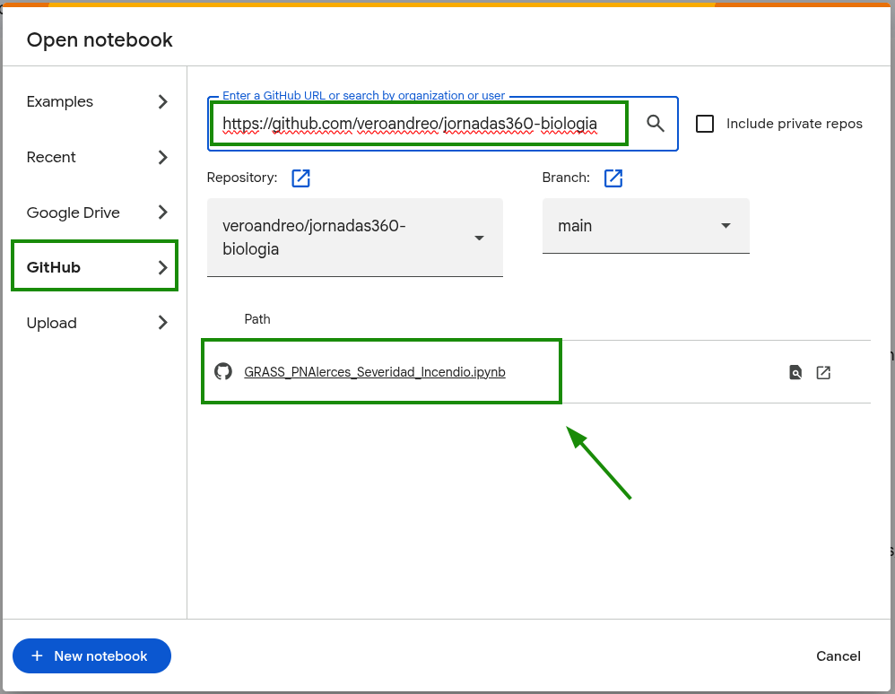

## Introducción y Objetivos

El objetivo de este taller es realizar una demostración básica sobre el uso de herramientas geoespaciales para evaluar el impacto de disturbios ambientales, tomando como caso de estudio los incendios ocurridos durante el verano de 2026 en el Parque Nacional Los Alerces y la zona de Cholila.

Realizaremos el mismo análisis técnico utilizando **tres metodologías distintas**. El propósito es demostrar la versatilidad de las plataformas actuales, comparando flujos de trabajo tradicionales con software "de escritorio" frente a enfoques basados en código automatizable, reproducible y escalable:

1.  **QGIS (Software de Escritorio):** La metodología tradicional basada en interfaces gráficas ("clics"). Es ideal para la inspección visual detallada y la producción de cartografía final.
2.  **Google Earth Engine (GEE - Cloud Computing):** Procesamiento masivo en la nube. Permite analizar petabytes de datos sin descargarlos. Es una herramienta potente y gratuita para fines académicos, aunque su infraestructura es de código cerrado.
3.  **GRASS GIS en Google Colab (Open Source & Scripting):** Representa la filosofía del software libre y de código abierto (FOSS). Utilizaremos el motor de procesamiento de [GRASS](https://grass.osgeo.org/) dentro de un entorno de Python, garantizando la reproducibilidad científica total del análisis.

## Datos

Los datos están en una carpeta de Google Drive 
([link](https://drive.google.com/drive/folders/1vAlX7hSPWs7J_LaUtgW5V1Kp4D7aogg3?usp=sharing)). 
Es necesario hacer una copia de la misma en sus drives personales
y descargar desde allí para la primera actividad. 
En la tercera parte los vamos a leer directamente de sus drives.

---

## Parte 1: Tutorial en QGIS (Software de Escritorio)

En esta etapa trabajaremos con las bandas originales de Sentinel-2 contenidas en los archivos `S2_PNAlerces_pre.tif` y `S2_PNAlerces_post.tif`.

### 1. Carga de Datos e Identificación de Bandas

Al abrir los archivos en QGIS, el programa asigna números a las bandas.

- S2_PNAlerces_pre.tif

| N° Banda | Nombre Original | Descripción |
|:---:|:---|:---|
| 1 | B2_pre | Azul (Visible) - Pre-fuego |
| 2 | B3_pre | Verde (Visible) - Pre-fuego |
| 3 | B4_pre | Rojo (Visible) - Pre-fuego |
| 4 | B8_pre | NIR (Infrarrojo Cercano) - Pre-fuego |
| 5 | B11_pre | SWIR 1 (Infrarrojo de Onda Corta) - Pre-fuego |
| 6 | B12_pre | SWIR 2 (Infrarrojo de Onda Corta) - Pre-fuego |

- S2_PNAlerces_post.tif

| N° Banda | Nombre Original | Descripción |
|:---:|:---|:---|
| 1 | B2_post | Azul (Visible) - Post-fuego |
| 2 | B3_post | Verde (Visible) - Post-fuego |
| 3 | B4_post | Rojo (Visible) - Post-fuego |
| 4 | B8_post | NIR (Infrarrojo Cercano) - Post-fuego |
| 5 | B11_post | SWIR 1 (Infrarrojo de Onda Corta) - Post-fuego |
| 6 | B12_post | SWIR 2 (Infrarrojo de Onda Corta) - Post-fuego |

### 2. Visualización Dinámica

#### Color natural (Pre-fuego)

1. Click derecho en la capa pre fuego -> **Propiedades** -> **Simbología**.
2. Tipo de renderización: **Color multibanda**.
3. Asignar: Rojo = `S2_PNAlerces_pre@3` (RED), Verde = `S2_PNAlerces_pre@2` (GREEN), Azul = `S2_PNAlerces_pre@1` (BLUE).
4. Click en **Aceptar**.

#### Falso Color SWIR (Post-fuego)

Para resaltar el área quemada en la imagen posterior al incendio:

1. Click derecho en la capa -> **Simbología**.
2. Tipo de renderización: **Color multibanda**.
3. Asignar: Rojo = `S2_PNAlerces_post@6` (SWIR), Verde = `S2_PNAlerces_post@4` (NIR), Azul = `S2_PNAlerces_post@3` (RED).
4. Click en **Aceptar**.

### 3. Álgebra de Bandas: Cálculo de NDVI y NBR

1. Ir a **Ráster > Calculadora ráster**.
2. Introducir la siguiente fórmula:
  * **NDVI Pre-fuego:** `("S2_PNAlerces_pre@4" - "S2_PNAlerces_pre@3") / ("S2_PNAlerces_pre@4" + "S2_PNAlerces_pre@3")`
3. Guardar el resultado como `ndvi_pre.tif`.
4. Visualizar con diferentes paletas de colores.
5. Repetir el procedimiento para las siguientes fórmulas:
  * **NDVI Post-fuego:** `("S2_PNAlerces_post@4" - "S2_PNAlerces_post@3") / ("S2_PNAlerces_post@4" + "S2_PNAlerces_post@3")`
  * **NBR Pre-fuego:** `("S2_PNAlerces_pre@4" - "S2_PNAlerces_pre@6") / ("S2_PNAlerces_pre@4" + "S2_PNAlerces_pre@6")`
  * **NBR Post-fuego:** `("S2_PNAlerces_post@4" - "S2_PNAlerces_post@6") / ("S2_PNAlerces_post@4" + "S2_PNAlerces_post@6")`
6. Guardar los resultados como: `ndvi_post.tif`, `nbr_pre.tif` y `nbr_post.tif`.

### 4. Cálculo de Severidad del incendio (dNBR)

Una vez obtenidos los índices NBR, calculamos la diferencia:

1. Abrir Calculadora ráster.
2. Fórmula: `"nbr_pre@1" - "nbr_post@1"`.
3. Guardar como `dnbr.tif`.
4. Visualizar con diferentes paletas de colores.

### 5. Enmascaramiento de Agua (Usando SWIR)

El agua puede dar valores de severidad falsos. Vamos a crear una máscara donde los valores de la banda SWIR pre-fuego sean bajos:

1. Abrir Calculadora ráster.
2. Fórmula para identificar "tierra firme":
   `"S2_PNAlerces_pre@5" > 500`
   *(Esto genera una capa donde 1 es tierra y 0 es agua)*.
3. Multiplicar `dnbr` por esta máscara para "limpiarlo":
   `"dnbr@1" * ("S2_PNAlerces_pre@5" > 500)`
4. Guardar el resultado como: `dnbr_masked.tif`

### 6. Clasificación de la severidad

Para identificar solo las áreas **severamente quemadas**, necesitamos convertir los valores continuos en categorías discretas para el análisis estadístico:

1.  Buscar en la Caja de herramientas de procesos: **Reclasificar por tabla**.
2.  Capa de entrada: `dnbr_masked`.
3.  En **Tabla de reclasificación**, hacer click en los puntos suspensivos y añadir 4 filas:

| Mínimo | Máximo | Valor | Categoría (Info) |
|:---:|:---:|:---:|:---|
| -1.5622 | 0.1 | 1 | No quemado |
| 0.1 | 0.27 | 2 | Severidad baja |
| 0.27 | 0.44 | 3 | Severidad moderada |
| 0.44 | 1.8005 | 4 | **Severidad Alta** |

### 7. Estimación de Superficie severamente quemada

Para saber cuántas hectáreas se quemaron:

1. Ir a la **Caja de herramientas de procesos**.
2. Buscar la herramienta **Informe de valores únicos de capa ráster**.
3. Seleccionar la capa reclasificada.
4. El reporte dará el conteo de píxeles por clase. 
5. **Cálculo:** $$\text{Área (ha)} = \frac{\text{Número de píxeles} \times 100 \text{ m}^2}{10,000}$$
   *(Recordar que cada píxel de Sentinel-2 mide 10x10 metros)*.

---

## Parte 2: Google Earth Engine 

Esta metodología permite realizar todo el análisis anterior sin descargar un solo byte de datos a la computadora local.

* **Filosofía:** "Traer el algoritmo a los datos".
* **Acceso:** El script completo con el filtrado por nubes, composición de medianas y cálculo de índices se encuentra en el siguiente link: <https://code.earthengine.google.com/ddfd19fbad81e4ff84df80ebf00df7b7>

---

## Parte 3: GRASS GIS en Google Colab (FOSS & Scripting)

Para esta sección, utilizaremos un cuaderno de Python (Notebook) para ejecutar comandos de **GRASS** y reproducir el mismo ejercicio. 

Para abrir la notebook en [Google Colab](https://colab.research.google.com/), solo usen la URL 
de [este repositorio](https://github.com/veroandreo/jornadas360-biologia) como se muestra abajo:

